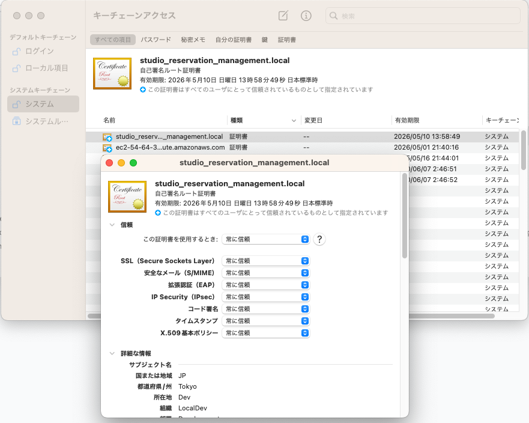

# ローカル環境をドメイン指定でアクセス

## /etc/hostsに下記を追加

```
127.0.0.1 front.local back.local
```

## サーバー証明書をOSで読み込んで信頼する。

下記ファイルをfinderでダブルクリックで開く
docker/nginx/certs/studio_reservation_management.local.crt

キーチェーンアクセスに登録されるので、「システムデフォルトを使用」から「常に信頼」に変更する。



ブラウザを立ち上げ直す

# Dockerコンテナへの入り方

## バックエンド

```bash
docker compose exec php bash
```

## フロントエンド

```bash
docker compose exec nuxt bash
```

# 開発環境のセットアップ

## バックエンドのセットアップ

phpコンテナで実施

```bash
composer install
cp .env.example .env
php artisan key:generate
php artisan jwt:secret
php artisan migrate
php artisan db:seed --class=Database\\Seeders\\Prod\\ProdDatabaseSeeder
// ログイン用のオーナーを用意
php artisan app:create-owner-command {email} {password}
# もし開発環境のデータを入れたい場合は下記を実行
# php artisan db:seed --class=Database\\Seeders\\Dev\\DevDatabaseSeeder
php artisan storage:link
php artisan ide-helper:generate
php artisan ide-helper:meta
composer helper:models
```

## フロントエンドのセットアップ

nuxtコンテナで実施

```bash
cp .env.example .env
npm i
```

# 静的解析・テストの実施等

## バックエンドの静的解析・フォーマット・テスト

phpコンテナで実施

```bash
composer analyse
vendor/bin/pint -v
php artisan test
```

## フロントエンドのフォーマット

nuxtコンテナで実施

```bash
npm run format
```
